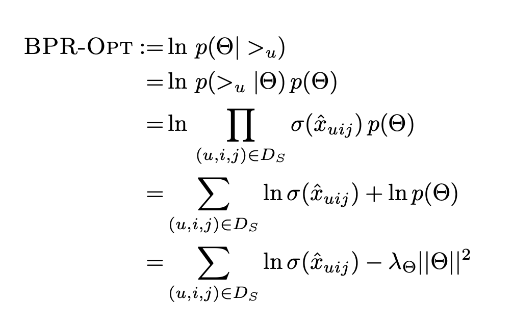

# 📖 Critica: Bayesian personalized ranking from implicit feedback...

### 📚Contexto:
Entre los problemas de recomendación (personalizada), se entiende por _item-recommendation_ al problema en el cual se busca entregar una lista personalizada y ordenada de _items_ (**ranking**) para cada usuario. La idea es estudiar las interecciones pasadas que cada usuario a tenido y, a partir de estas, identificar por cuales _items_ el usuario puede tener mayor preferencia. Estas interacciones _item-usuario_ pueden ser de forma explícita (_rating_, _like_, _dislike_, etc) o implícita (tiempo, fecha, clicks) y, desde estas, diferentes modelos se han desarrollado para aprovechar uno o los dos tipos de información.

Este paper explora una alternativa al _approach_ usual que han tenido las técnicas centradas en _implicit data_, bajo la premisa de que la mayoría de estos modelos son entrenados con ciertas métricas (**preferencia individual**), pero evaluados bajo tareas distinta. Con esta idea se propone un esquema de optimización y entrenamiento que es capaz de reducir el tiempo de entrenamiento y mejorar ampliamente el rendimiento sobre los modelos en los que se aplican.

### 🧾 Propuesta:
Uno de los principales problemas a la hora de construir recomendadores con información implícita, es que estos _datasets_ carecen de una distinción clara entre **_feeback_ negativo** y datos "nulos" (ie: que el usuario piense comprar en el futuro o no haya "encontrado" el item). Para solucionar este problema, los autores proponen descomponer los datos de training en tipletas (u, i, j), donde se denota **solo la preferencia de i sobre j**, de esta forma podemos utilizar _feeback_ positivo y dejar vacío las tuplas donde no se puede asegurar preferencia. A partir de esta organización de los datos, los autores presentan su criterio de optimización **BPR-Opt**:

#### 🎖 Esquema de entrenamiento:
Basado en análisis bayesiano, se busca maximizar la probabilidad posterior del conjunto de preferencias del usuario _u_ y, desde su expresión por cada _item_, se desprende la siguiente función de pérdida:

> 

En la cual se utiliza **&sigma;(x)** que denota la función sigmoidea y lo hace que toda la expresión sea diferenciable. Acá, debo destacar que en el paper se presenta un (muy) extenso y riguroso análisis estadísticio del porqué esta formulación funciona y cómo asegura llegar al resultado deseado (lo cual es una aspecto positivo, pero hizo un poco difícil la lectura).

Finalmente, utilizando la función de pérdida se formula un esquema de entrenamiento llamado **LearnBPR**, el cual es un algoritmo de _stochastic gradient descent_, pero que introduce aleatoreidad (con reemplazo) a la hora de elegir el siguiente dato con el cual entrenar.

### 💻 Aspectos Positivos:

Creo que es importante **destacar el primer motivo del paper**: que las métricas de evaluación y entrenamiento pueden no ser siempre las correctas para los que se busca aprender. Esto es algo que discutí en los comentarios anteriores y creo que es clave a la hora de explicar los buenos resultados de este esquema.

Por la parte de experimentación, los resultados hablan por si solos, el método propuesto no solo converge mucho más rápido que los métodos tradicionales, sino que también mejora el rendimiento en gran medida. Además, creo que la *8experimentación que realizaron fue bastante exhaustiva**, en el sentido que probaron y reportaron los resultado de su esquema aplicado a varios modelos bien populares.

Finalmente, el hecho de haber hecho su análisis sobre dos _datasets_ diferentes (y de naturaleza distinta), aporta a dar más una validez general del esquema. Acá quizás se pudiera incluir un análisis en _datasets_ donde el _ratio_ ```users/items``` sea menor a 1, pero creo que no era el principal objetivo del paper.

### 📕 Aspectos en contra:
Realmente, el único punto que no se abarcó fue el método de _Maximum Margin Matrix Factorization (MMMF)_ , del cual los autores hablan y comparan con el suyo, pero no llegan a compararlo. Creo que el principal problema con esto es que se habla de que son métodos muy similares e incluso se propone un esquema para que el algoritmo funcione con información ímplicita, pero aún así no se hace experimentalmente. Esto me da algo de inseguridad respecto a si este método puede tener mejores resultados que el que ellos propusieron.

### 🎉 Una conclusión:
Me parece que este paper cumple muy bien su objetivo al proponer este gran esquema de optimización y entrenamiento. Especialmente, me parece muy importante la idea que tuvieron para manejar los datos datos nulos vs el _feedback_ negativo, pues si bien no es el ideal, creo que es capaz de utilizar más información que los métodos que existían antes de este paper. Por otra parte, la idea de cambiar **lo que se está optimizando** creo que fue un importante paso hacia obtener mejores métricas de evaluación/entrenamiento.
