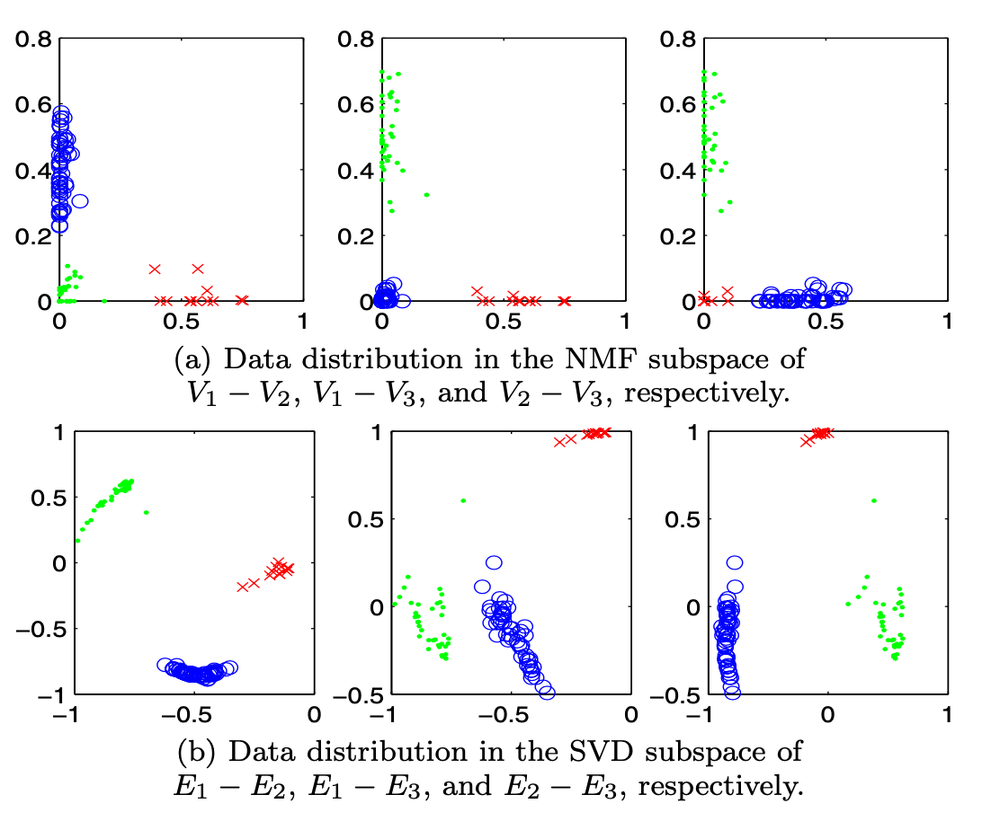

# 📖 Critica: Document Clustering Based On Non-negative Matrix Factorization
  
- Latent semantic indexing method SVD.
    
- Bastante bueno para la representación de los clusters.
  
### 📚Contexto:

Si bien este paper no está directamente relacionado con la implementación de sistemas recomendadores, me parece que la idea detrás de _Document Clustering_ es bastante similiar a otras que ya hemos explorado en el curso (de hecho ocupa técnicas similares).

El problema de **_Document Clustering_** se puede dividir en dos grandes áreas, _agglomerative clustering_ y _partitional clustering_. Los autores basan su propuesta en este segundo grupo, que tiene como idea base descomponer los documentos en _clusters_ disjuntos y que, en la construcción de estos, se pueda llegar al óptimo de una función específica. De forma más detallada, los autores originan su propuesta desde **una idea similar a la de _Latent Semantic Indexing Method (LSI)_**, que descompone cada documento a un espacio de vectores singulares utilizando _SVD_.

## 📈 Propuesta:
Según los autores, el método de _LSI_ tenía dos grandes problemas: 1. El uso de _SVD_ produce valores negativos, por lo que **no hay un real valor semántico** en cada dirección y 2. Aún **se requiere utilizar métodos de clustering tradicionales** a partir de los resultados.

Así, los autores proponen un modelo basado en _Non-Negative Matrix Factorization (NMF)_. La idea principal es establer un espacio vectorial donde **cada eje corresponda a un _tópico_ (tipo) distinto de documento** y que, **cualquier documento se puede modelar como una combinación lineal de estos tópicos**.

✅ Desde esta primera vista, este método tiene el beneficio de ser bastante más autoexplicativo que el método de _LSI_. De todas formas, creo que partir de la base que de _LSI_ no puede tener valor semántico por tener valores negativos es un error, ya que podría significar componentes opuestas. Creo que este punto depende más de cómo se define las categorías en cada texto (el _embedding_ que se le hacen a las palabras de este).

😐 Una vez que su modelo descompone en sus componentes a un documento, sus valores _xi_ van a estar en el rango [0, 1] y, nn el algoritmo de los autores, se utiliza el _xi_ con mayor valor para determinar a qué cluster pertenece. Si bien no puedo decir que esto es negativo, ya que en un problema de _clustering_ se debe definir solo una clase, creo que en este punto hay un gran pérdida de información. Especialmente, siento que en los casos donde hay varios valores con > 0, **la información que da esta descomposición es bastante significativa** y, creo, que tiene harto sentido incluirla en una aplicación de recomendación (el punto clave de la **explicatividad de los resultados**).

Para comparar con el método de LSI, los autores presentan un ejemplo visual de sus resultados en un _dataset_ con 3 _clusters_. En la imagen se pueden ver los resultados obtenidos en cuanto a sparabilidad de la información y los valores en los ejes.

   

❌ En este punto, que es como una forma más visual de ver lo que hace su modelo, me hubiera gustado ver la separación que logra en _datasets_ que cuentan con más _clusters_ (En este caso existían solo _3 clusters_). Ya que si bien es importante dar un significativo positivo a cada eje, la separabilidad de los _clusters_ es lo que prima en los rendimiento que estos obtienen y, a simple vista, no hay diferencia sustancial entre ambos modelos.

### 📈 Recommender System Properties

### 📕 Conclusión:

## 🖇 Bibliografía Revisada:

