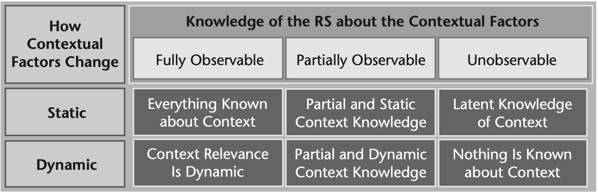
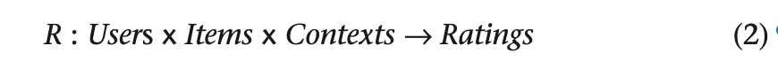

# 📖 Critica: Context-Aware Recommender Systems
 
### 📚Introducción:

Hasta el momento hemos estudiado sistemas recomendadores que son capaces de manejar tanto información **_explícita_** como **_implícita_** entregada por el usuario. Si bien estos sistemas han mostrado buenos desempeños en los problemas vistos hasta el momento, estos algoritmos más "tradicionales" caen al no consideran las _situated actions_ que hacen los usuarios, esto es:

> (...) the fact that users interact with the system within a particular "context" and the preferences for items within one context may be different from those in another context.

 Así, este artículo explora y presenta un nuevo tipo de sistema recomendador: el **Context-Aware Recommender System**, con el objetivo de incluir la información _contextual_ que tiene un usuario al momento de hacer una recomendación.

Como la idea de este _paper_ es de exponer y presentar el estado del arte en este tipo de sistemas, este artículo **no presenta experimentación** y se basa más en la recolección de **conceptos claves** en la construcción de estos algoritmos. A continuación se repasarán los principales:

## 😎 Contexto:
Como bien se dice en el paper, la definición de este concepto no está unificada y varía según el área de estudio. Aún así, el artículo se centra en las dos visiones de context entregadas por ```Dourish (2004)```: **_representacial view_** y **_interactional view_**.

 El primero se basa en la suposición de que el contexto del usuario es __estable e independiente de la acción__ que este realiza y que, además, el contexto se puede modelar con "atributos" observables. Por otra parte, la segunda visión es que el contexto es algo que surge y que sus **"variables contextuales" son dinámicas**.

 ⛔️ Si bien no es una crítica como tal, a mi parecer, la segunda idea es mucho más poderosa, sobre todo en implementaciones que se pueden hacer hoy en día. Con esto voy a qué aprovechando los modelos más complejos que existen hoy se podría "aprender" de mejor manera la generación de estos contextos.

Luego los autores hablan sobre los **_contextual factors_**, que, basícamente, es la información disponible sobre el contexto que puede tener un sistema. Sobre estos se hacen dos clasificaciones: **Qué tanto sabe el sistema de los _contextual factors_?** y **Cómo los _contextual factors_ cambian en el tiempo**. A partir de estos se hacen las siguientes 6 clasificaciones:

  

✅ Si bien los autores centran su estudio (y ejemplos) en los _Static_ _contextual factors_, también explican, con poca profundidad, el caso _Dinámico_. Esto para mi no es un _pro_, pero me dio la oportunidad de estudiar un poco sobre los **_Conversational Recommender Systems_** [1], que basandose en la misma idea que se habla en el artículo y con técnicas actuales de _Deep Reinforcement Learning_ y _NLP_ son capaz de aprovechar esta información que, si bien en el paper [1] no se explica como "contexto" del usuario, describen la misma información. Esto creo que es importante ya que cada vez se ven más aplicaciones tipo "_chatbots_" que pueden aprovechar super bien esta tecnología.

## 📈 Cómo recomendadar:
Como último punto conceptual, los autores presentan los distintos esquemas o "paradigmas" que se ocupan para hacer recomendaciones utilizando el contexto. La base de todo esto, lo hacen a partir de la **predicción del _rating_**, una función de la sigueinte forma:



❌ Si bien los autores hablan que la función _R_ puede ser vista como una de utilidad cualquiera, creo que hubiera sido importante comentar resultados de _papers_ que avalúen estos sistemas en problemas no solo basados en predicción de _rating_. Sobre todo cuando estamos hablando de contexto esto me parece una diea importante, pues, dado ciertos contexto, el usuario podría querer "descubrir" películas, cosas que caen al apreciar solo el _rating_ predicho.

A partir de esta función, sehabla de tres paradigmas: **_Contextual Prefiltering_**, **_Contextual Postfiltering_** y **_Contextual Modeling_**


## 📕 Conclusión:

## 🖇 Bibliografía Revisada:

1. Yueming Sun and Yi Zhang. (2018). [Conversational Recommender System](https://arxiv.org/pdf/1806.03277.pdf). In The 41st International ACM SIGIR Conference on Research & Development in Information Retrieval.