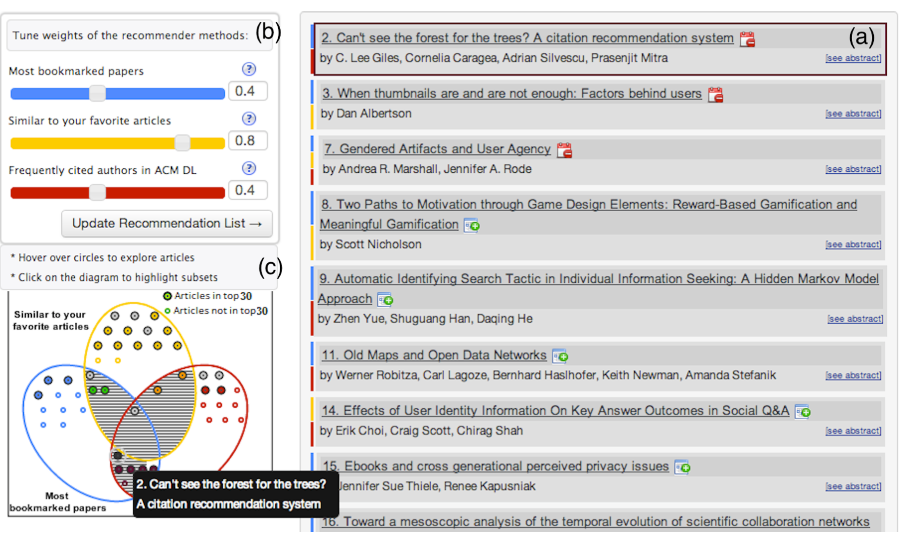
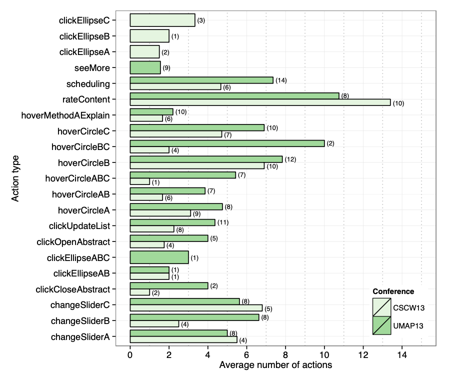

# 📖 Critica: See What You Want to See: Visual User-Driven Approach for Hybrid Recommendation.
 
## 📚Introducción:

En la misma linea que la lectura anterior, este *paper* nace de la idea de que sistemas con mejor *accuracy* no siempre llevan a una mejor experiencia de recomendación para el usuario. Así, los autores prefieren llevar su investigación sobre *Human Computer Interaction*, que se centra en estudiar las características de la interfaz y el usuario que influencian el uso de sistemas recomendadores.

Desde esta rama de investigación los autores presentan **SetFusion**, una interfaz orientada a la interacción con el usuario y que busca tener como foco de la recomendación la **explicabilidad** y el **control que el usuario puede tener** ser sobre esta. Además, las recomendaciones que se realizaron estaban basadas en un *Hybrid Recommender* sobre charlas de conferencias científicas.

## 📈 SetFusion:

La interfaz que se propone en el *paper* tiene tres grandes componentes, orientados profundamente en la interacción que el usuario puede lograr sobre la aplicación, estos son: **_Diagrama de Venn_**, **_Sliders_** y **_Lista de Recomendaciones_**.

  

 A continuación se analizará cada uno de estos:

1. **Diagrama de Venn:** Presenta un visualización sobre las tres fuentes de recomendación que tiene la aplicación y permite ver qué recomendaciones salen de cada una de estas fuentes.
    
    ✅ Personalmente me parece una inclusión siginificativa y destaco el hecho de que, si bien esta aplicación este pensada para expertos en el área, los *labels* que tiene son bastante explicativos para entender cada tipo de recomendación. Además, creo que el hecho de poder explorar directamente desde acá permite al usuario hacer una búsqueda mucho más controlada (que solo recibiendo una lista de recomendaciones).

2. **Sliders:** Permiten hacer un *tuning* de la recomendación, inclinando el listado hacia un esquema más que a otro. Es lo que esencialmente brinda control al usuario sobre las recomendaciones que recibe.

    ⚙️ Personalemente me parece que es una adición que si bien la da gran control al usuario (lo que aumenta la predispocisión del usuario frente al sistema), puede ser un arma de doble filo para usuario que no estén muy familiarizados con la aplicación o busquen otros tipos de comodidades (recomendaciones rápidas). Creo que esto depende del tipo de recomendación que el sistema haga, pero, personalmente, no me puedo imaginar ocupando un sistema de este estilo en, por ejemplo, un recomendador de música (aunque lo encuentro genial en el contexto de la conferencia).

3. **Lista de Recomendaciones:** Muestra las recomendaciones, incluyendo la información de la fuente de la recomendación, autores y abstract. Además, se incluye la idea de "guardar" la conferencia.

    ✅ Me parece el mejor elemento de los tres ya que es simple y uno ya está familizarizado con esto, pero mejora la explicabilidad (*hover* en la fuente). Si tuviera que agregar algo, creo que sería interesante ver la popularidad de una charla, por ejemplo, poder visualizar cuánta gente a guardado un evento.

## 📈 Experimentación:

La interfaz e implementación fue testeada en dos conferencias, la primera con un fin de prueba piloto y la segunda para obtener resultados más específicos y comparativos de la interfaz. Estas fueron las conferencias ```CSCW 2013``` y la ```UMAP 2013```.

Según los resultados expuestos en el paper, en ambas conferencias **se mantuvo una cantidad similar de asistentes** (o personas con acceso a la interfaz), pero hubo una aumento significativo en **las métricas de uso** (cantidad de usuario, marcar como "favorito", etc.). Esto significaría que hubo una interacción más completa con la aplicación.

❌ Personalmente siento que las métricas estudiadas para justificar que hubo un mayor uso de la aplicación relativamente buena, pero, de todas formas, se menciona que las métricas de tiempo (y otras métricas de *engagement*) aumentaron. Si bien esto se justifica que con el hecho de que este crecimiento fue menor que el crecimiento de uso de la aplicación, creo que habría que tener cuidado con las métricas de tiempo, ya que no necesariamente están tan ligadas a mejores recomendaciones o una interfaz más directa (podría ser que el usuario se queda solo con las que aparecen incialmente). En este sentido, se puedo haber hecho una compensación por número de búsquedas, etc.

Finalmente, en la sección de *action analysis*, los autores analizan varíos datos implícitos recolectados en la interfaz. Donde, entre otros elementos, se puede ver un aumento significativo en el uso del *diagrame de Venn*. A continuación se puede ver un gráfico de todos estos datos:

  


✅ Personalmente, me parece positivo la recolección de estas interaccions, pues no solamente se pueden utilizar para analizar la interfaz en si, sino que también sirve para, potencialmente, mejorar el sistema recomendador que hay detrás de ella (*implicit feedback*).