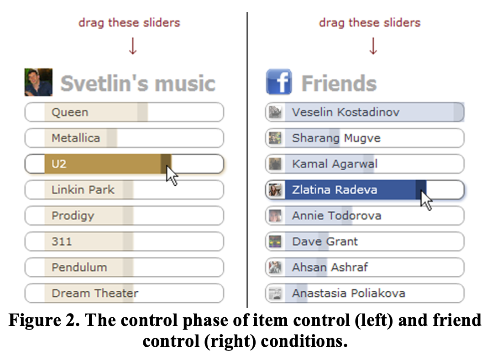
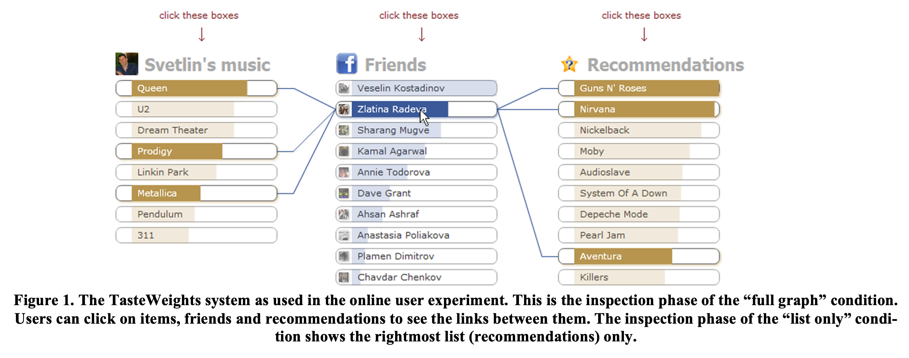
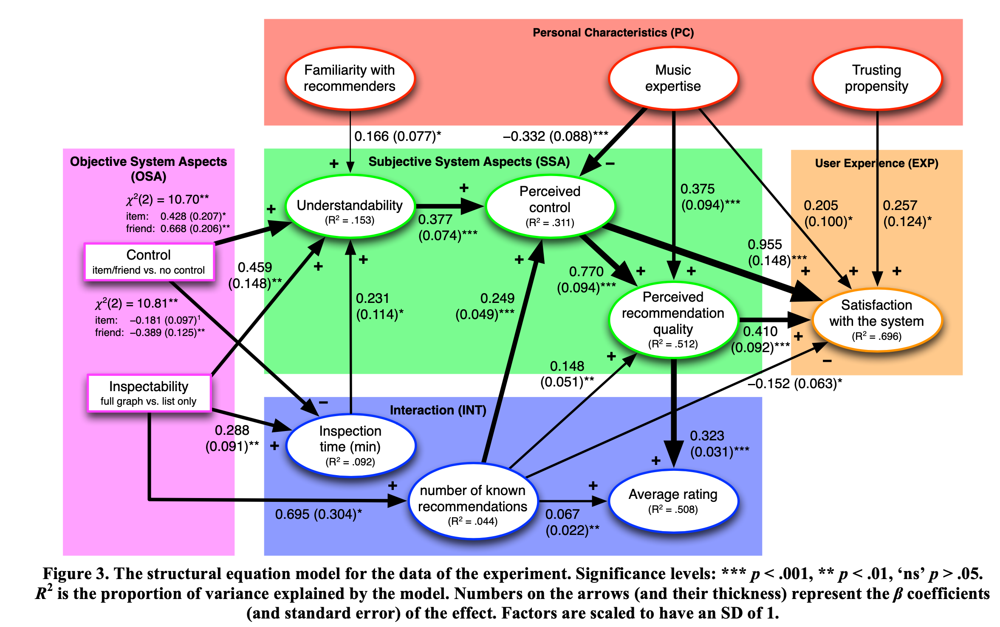

# 📖 Critica: Inspectability and Control in Social Recommenders
 
## 📚Introducción:

En esta lectura, los autores *Knijnenburg y Bostandjiev* hacen un análisis profundo de la experiencia de los usuarios al utilizar un sistema recomendador, específicamente, un **Recomendador Social**. Tal como en trabajos anteriores (como los otros analizados esta semana), los autores proponen que este tipo de recomendadores (que tiene una base cercana a los colaborativos) las cualidades de *inspeccionabilidad* y *control* son fundamentales para el usuario y que pueden potenciar, de manera significativa, una visión positiva del sistema.

En este contexto, los autores deciden testear esta hipótesis con un caso de estudio sobre un recomendador de música (artistas/bandas) basado en interacciones de *Facebook* de los usuarios.


## 🥑 TasteWeights:

El sistema recomendador social utilizado se basa en la similitud (*overlap* de *likes*) que cada usuario tiene con sus amigos (de *Facebook*). Luego **se asocian pesos a cada amigo** y se hace un score para las recomendaciones (de *items*) basada en la suma ponderada por estos pesos. En los capítulos de [1] y [2] se habla ampliamente del tema y como, desde la evoluación de la *web social*, el análisis de relaciones entre usuarios fue cobrando importancia, hasta el día de hoy ser datos fundamentales para ser considerados en recomendadores de todo tipo.

✅ Si bien no es el principal objetivo el *testear* el tipo de sistema recomendador, me parece que un algoritmo de este tipo tiene bastante sentido y que, agregando un par de cosas, podría ser un sistema super potente.
Principalmente, creo que algo que podría ser realmente positivo es la inclusión de la información de *dislikes*, que podría ser significativo para filtrar recomendaciones "malas".

❌ Algo que creo podría ser negativo en este sistema, es que siento que se podría perder algo de *novelty* por el significado mismo que tienen los amigos (se comparten gustos bien similares). En este sentido, creo que habría que tener especial cuidado cuando se le asignan pesos demasiado significativos a "mejores amigos", donde, siento, la mayoría de las recomendaciones pueden ya ser conocidas.


## 🎹 Interfaz (*TasteWeights*):

La interfaz (y la principal herramienta a testear) se basa en el *tuning* y *visualización* del sistema recomendador antes expuesto.

La configuración de los parámetros y, específicamente los pesos, se hace en base a **dos tipos de  *sliders*** (uno para amigos y otro para *items*). Estos se muestran en la siguiente figura:

  

✅ Personalmente siento que la elección para *sliders* para este método es bastante inteligente, sobre todo porque permite separar el concepto de pesos para un usuario que no está ilustrado en el tema (da un poco de relatividad a los pesos). De todas formas, creo que esta solución puede no escalar bien cuando se quieren incluir más *items* o amigos al *tuning*.

Por otro lado, las recomendaciones generadas pueden ser visualizadas de dos maneras: **un grafo completo**, donde se muestran los amigos y las bandas o una **lista simple de recomendaciones**. A continuación una vista de esto (la lista simple es similar a la de la columna de la derecha):



😬 Personalmente, siento este esquema es super explicativo, pero que puede confundir un poco en la primera inspección de la aplicación (por lo menos viendolo por primera vez y sin haber leído lo que es). En este sentido, creo que debe ser un tema importante a considerar cuando se habla de los ```7.3 seg``` extras que se gastan explorando el grafo. De todas formas, la información que otorga es muy superior a solo una lista.

## 🧪 Experimentación:

Para la puesta en marcha del experimento, los autores decidieron dividir a los usuarios en distintos grupos y cada uno asignarles opciones de control (*sliders*) y visualización (*graph* o lista) distintas. La idea de esto era generar grupos de control para determinar como el cambio de control y explicabilidad de las recomendaciones cambia la satisfacción que el sistema genera en los usuarios.

✅ Creo que la idea de poner grupos de control es muy buena y es algo que no se vio en las otras lecturas de esta semana. Lamentablemente, el *n* de estudio creo que no era lo suficientemente grande como para hacer grupos para cada combinación posibles (y si lo hicieron, creo que no serían muy representativos).

❌ El punto en contra y algo que ellos mismo dicen en el cierre del documento, es que no se probó un grupo donde ambas *sliders* estuvieran presentes. Creo que esto hubiera sido significativo en el sentido que ambos son elementos bastante significativos y que a la mayoría de los usuarios les gustaría interactuar con ambos.

Finalmente, dado los resultados obtenidos, los autores proponen un *structural equation model*:



✅ Personalmente, me parece que si bien hay MUCHA información en el esquema, esta está bien explicada. Además, obviando el hecho de que hay que tomarse un tiempo para entender complemente el modelo, me parece que hacer la división de características según dominio (*Personal Characteristics*, *User Experience*, etc) da un buen pie para entender de buena forma todos los resultados obtenidos.

### 📎 Referencias Estudiadas:

1. Ricci, F., Rockach L., Shapira B. (2010). Social Recommender Systems. Recommender Systems Handbook (pp. 511-522).

2. Memon, N., Jie Xu, J., Hicks D, *et al*. (2010). A Social Network-Based Recommender System (SNRS). Data Mining for Social Network Data (pp. 47-74).

