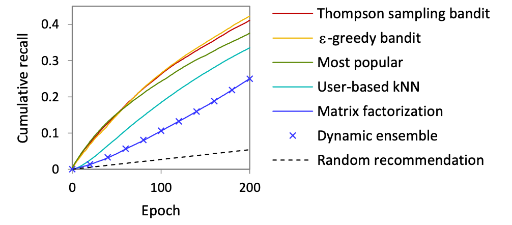

# 📖 Critica: Multi-armed recommender system bandit ensembles.
 
### 📚Introducción:

En este paper se propone un esquema de ensambles como parte de un sistema recomendador híbrido, la idea es que, a partir de varios sistemas recomendadores, se puede construir un solo sistema que optimice y encuentre la mejor combinación para el problema de recomendación.

Además, los autores van más allá y prueban su esquema de una forma que denominan "realista", donde se hace un proceso ciclico que busca similar la utilización del sistema recomendador.

En esta crítica se comentarán estos dos aspectos:

## 🧾 Método de ensamble:

En específico, los autores presentan un *Bandit Recommender System Ensembles*, un método donde cada "brazo" es un sistema recomendador distinto. La idea básica del esquema será optimizar la forma en que se eligen estos brazos a la hora de hacer una recomendación.

✅ Los métodos de ensambles han mostrado ser super eficientes en muchas tareas de *machine learning*, por lo que extenderlo a sistemas recomendadores hace mucho sentido. A partir de esto, creo que es un gran método y que probar distintos métodos de ensambles puede dar muy buenos resultados en este tipo de problemas.

Además, los autores utilizan dos métodos de selección para el algoritmo *e-greedy* y *Thompson method*.

❌ Si bien ambos métodos parecen ser de los métodos más utilizados en el momento del paper, existen métodos (como los explorados en la segunda lectura) que muestran mejores resultados mejores o similares, como *Upper Confidence Bound* (en [1]) u otras formas de abordar el método de *Thompson* ([2]) o *e-greedy*.

## 📈 Testeo Ciclíco:

Los autores hace el testeo de su modelo de forma "offline", pero de una forma en la cual se puede simular el uso en el tiempo del sistema recomendador. Para esto, se parte de una porción pequeña del *dataset* total y se van generando recomendaciones y, a partir si se encuentra en el resto del dataset, se formula un *reward* postivio o negativo. Esto hace por *épocas*, donde en cada una se recomienda solo un *item* a cada usuario.

✅ Me parece fundamental y necesaria esta forma de testear sistemas recomendadores, ya que hasta ahora, los métodos de testeos mostrado son malos simulando el uso real de un sistema recomendador.

Sobre el ensamble que los autores hicieron, usaron un esquema con dos sistemas de *collaborative filtering* ( **kNN** y **matrix-factorization**).

❌ El principal problema que encuentro es que se probaron solo dos métodos y en base solo a filtrado colaborativo. Esto es un problema, ya que un sistema de ensambles podría aprovechar mucho mejor la combinación entre *content-based* y *CF*, en este sentido, creo que los autores debieron utilizar diversos métodos (entiendo que igual podría deberse a un problema con el *dataset* utilizado).

## 💻 Resultados:

Los resultados experimentales obtenidos se muestran a continuación:

  

Desde estos podemos ver que el método que los autores proponen obtuvo mejores resultados que los "brazos" por si solos. En este sentido, el método de ensamble muestra un beneficio considerable, pero hay ciertas complicaciones que siento se debería atacar:

1. **El método de ensamble principal se mantiene constante:** La optimización del paper lleva a eligir casi siempre le método de *matrix-factorization*. Esto lo atribuyen a lo bueno que es este sistema, pero puede mostrar un problema del mismo esquema de optimización.

2. **El dataset muestra ser mejor en _most popular_:** Me parece extraño esto ya que generalmente *personalized recommendation* suele ser mejor que un método no personalizado, por lo que me gustaría investigar si esto se debe al esquema cíclico probado o porque realmente para el dataset *most-popular* es mejor.

## 📎 Bibliografía:

1. Auer, P., Cesa-Bianchi, N. & Fischer, P. Finite-time Analysis of the Multiarmed Bandit Problem. Machine Learning 47, 235–256 (2002). https://doi.org/10.1023/A:1013689704352

2. Chapelle, O., Li, L. (2011). An Empirical Evaluation of Thompson Sampling.