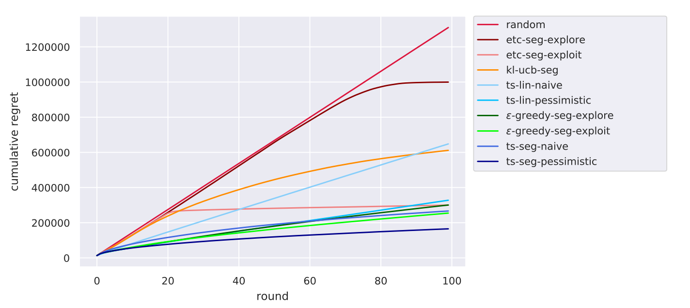

# 📖 Critica: Carousel Personalization in Music Streaming Apps with Contextual Bandits.
 
### 📚Introducción:

En este paper, los autores proponen un *framework* que modela el problema de *carousel personalization* como un *multi-armed bandit* (similar a los que se vió en la lectura (1) de esta semana). Esto es un problema desafiante e interesante ya que la contrucción personalizada de estos "carruseles" requiere de un enfoque recomendador, en el sentido de que la forma en la que se muestra los *items* se ve impactado por el interes del usuario en ellos.

De forma más específica, los autores moldean su *framework* en base a un *dataset* de *streaming* de música y, a partir de esto, muestran y testean distintos métodos de selección (*Thompson*, *Upper Confidence Bound*, *random*, *etc*) que se pueden aprovechar a la hora de atacar este tipo de problemas.

Finalmente, muestran los resultados experimentales obtenidos en sus investigación.

## 🧾 Framework:

El modelo propuesto tiene varias aristas que me parecen interesantes de analizar:

### 📈 Multi-Armed Bandit for Carousel Personalization:

Este tipo de algoritmos es de los más utilizados para la tarea de *sequential decision making* y, básicamente, funcionan seleccionando de una manera inteligente un subconjunto de los "brazos" que tiene el sistema. Estos brazos luego son evaluados y, dada una función de utilidad o *reward*, se puede optimizar de tal manera que el conjunto de "brazos" que se seleccione trate de maximizar esta función.

✅ Sobre cómo exactamente se seleccionan estos brazos, hay diversas maneras de hacerlo y en este *paper* los autores experimentan con varios derivados de formas tradicionales. En este sentido, creo que la basta experimentación que realizaron con este *item* es importante y justifica en gran medida los resultados que puedieron llegar a obtener.

Además, en el sistema propuesto, cada "brazo" es una modelación de un *item* distinto (que son albumes o canciones). Esto hace que, en cierta forma, lo que realmente se está tratando de optimizar y aprender, sea la mejor disposición de estos *items* en pantalla.

### 📕 Characteristics from User Preferences:

Se proponen dos métodos para obtener la información de preferencias del usuario, uno **semi-personalizado** y un **personalizado**. El primero, aplica un algoritmo de *clusterización* sobre los usuarios y colecta información general de cada uno de los *clusters* definidos. Para el segundo, se ocupa una estrategia llamada *contextual bandit setting* (en [1]), que aprovecha el valor del *reward* que produce el mismo algoritmo,

✅ Personalmente, creo que ambos métodos son bastantes interesantes (y, sobre todo, por los resultados que obtiene cada uno de ellos). De todas formas, creo que se pudo haber obtenido quizás información desde un *approach* más similar la de *matrix-factorization*, aunque esto tendría que ser de forma anterior al entrenamiento y pudiera hacer más costoso el algoritmo.

### 📕 Characteristics from Real-World Carousels:

Básicamente, es la forma en la que los autores pueden calcular el *reward* que cierto "carrusel" de *items* les entregó. Los autores hablan de un esquema tipo cascada, donde se asume que el usuario vio, por lo menos, todos los *items* hasta el *item* que seleccionó. Esto es algo que habíamos visto anteriormente como parte de la idea de *implicit feedback* y me parece importanta la aplicación en este tipo de sistemas.

✅ Personalmente, siento que la elección de este modelo es bastante acertado. Desde mi punto de vista, la idea detrás (de haber visto o no todos los *i* itemes) es buena y puede asemejar bastante la distribución real que tomarían estos datos. De todas formas, esto como idea personal, creo que aveces podría ser interesante ver un análisis más estadístico de estas suposiciones. Por ejemplo, que pasa si uno mete un ruido con distribución normal o, una forma más simple, asume que cada "x" usuarios se ven todos los elementos de la lista.

## 💻 Resultados y Conclusiones:

Como se dijo, uno de los puntos más fuertes de este *paper*, creo que son los variados métodos con los que se probó el esquema. En este sentido los autores reportaron los siguientes resultados (menor es mejor):

En estos se puede ver que hay una gran variación de acuerdo al método que se ocupa a la hora de hacer la selección de los "brazos" y que, entre estos, el mejor método parece ser el *ts-seg-pessimistic* (una variante del método de *Thompson Sampling*).

Además, los autores señalan que el método semi-personalizado obtiene mejores resultados. Para mi esto es bastante significativo, ya que los métodos de *clustering* "por si solos" no los hemos explorado en profundidad y, dado estos resultados, podría ser interesante estudiar las aplicaciones que pueden tener a nuestros problemas.

> our experiments emphasize the empirical benefit of semi-personalization via user clustering that, assuming good underlying clusters, might appear as a suitable alternative for such large-scale real-world applications.

## 🖇 Bibliografía Revisada:

1. Agarwal, A., Hsu, D., Kale, S., *et al*. (2014). Taming the monster: A fast and simple algorithm for contextual bandits.